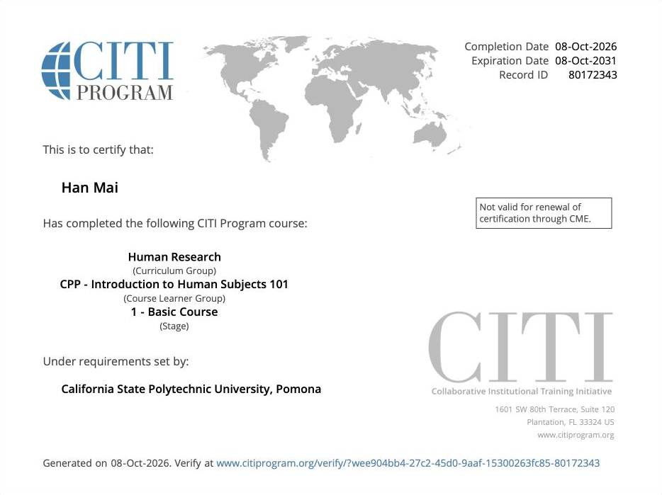

# Certification Completion

I completed the CITI course **CPP - Introduction to Human Subjects 101 (Basic Course)** and received the certificate shown below. The certificate lists my name, Han Mai, and a completion date of **08-Oct-2026**.

# Certificate

{#fig-citi-certificate width="100%"}

# Verification

Completion can be verified through the [CITI certificate verification page](https://www.citiprogram.org/verify/?wee904bb4-27c2-45d0-9aaf-15300263fc85-80172343).

# Appendix

-   [GitHub Repository](https://github.com/hanamai111/IBM6500-IC8-2-CITI-Certification)

-   [Published CITI Certification Report](https://hanamai111.github.io/IBM6500-IC8-2-CITI-Certification/citi-certification.html)

-   [CITI Certificate Verification](https://www.citiprogram.org/verify/?wee904bb4-27c2-45d0-9aaf-15300263fc85-80172343)
